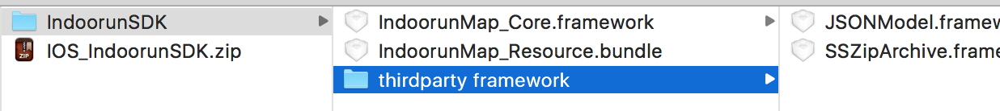
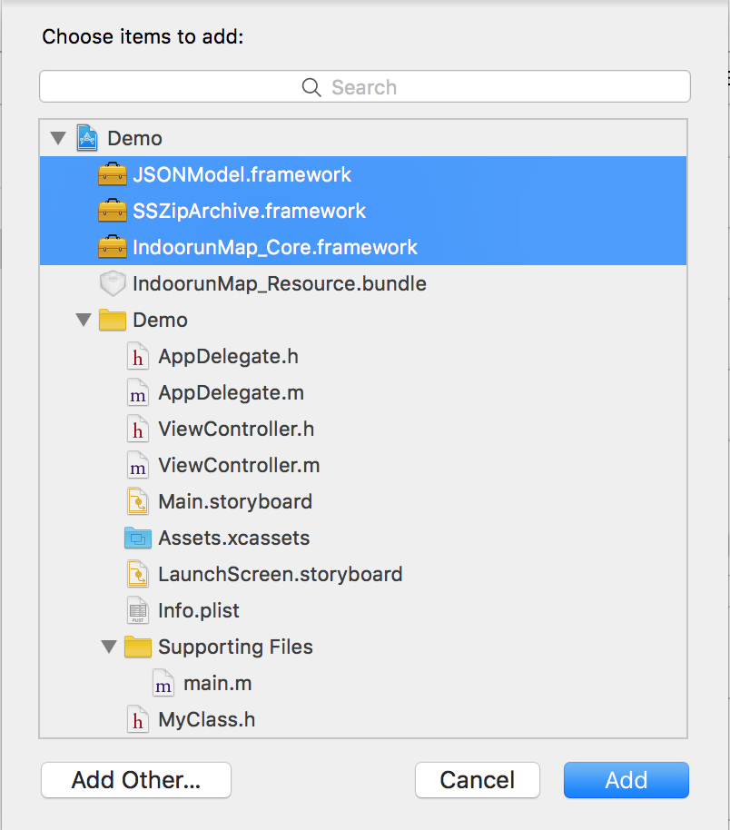

# sdk开发者文档

## 注意事项
1、由于iOS9改用更安全的https，为了能够在iOS9中正常使用地图SDK，请在"Info.plist"中进行如下配置，否则影响SDK的使用。
    
```<key>NSAppTransportSecurity</key>
    <dict>
        <key>NSAllowsArbitraryLoads</key>
        <true/>
    </dict>
```

2、开发者在使用过程中注意事项如下： 需要在info.plist里添加
（以下二选一，两个都添加默认使用NSLocationWhenInUseUsageDescription）：
 
```
NSLocationWhenInUseUsageDescription ，允许在前台使用时获取GPS的描述
NSLocationAlwaysUsageDescription ，允许永久使用GPS的描述
```


## 1、配置
### 开发环境配置
       
    iOS室内地图SDK的环境配置非常简单，只要引入室内地图库和相应的系统库，并导入资源文件即可

* ### 自动配置.framework形式开发包（使用CocoaPods）

    1、若已经安装了 iOS 地图 SDK，想更新到最新版本，使用以下命令：

        $pod update

    2、编辑 Podfile 文件，并保存。 Podfile文件如下：

        pod 'IndoorunMap_Core'  #Indoorun室内地图定位导航sdk     

    3、在Podfile所在的文件夹下输入命令：

        pod install （这个可能比较慢，请耐心等待……）
    成功后，会出现以下信息

        Downloading dependencies
        Using FMDB (2.6.2)
        Using IndoorunMap_Core (2.0.3)
        Using JSONModel (1.7.0)
        Using SQLCipher (3.4.0)
        Using SSZipArchive (1.6.2)
        Generating Pods project
        Integrating client project
        Sending stats
        Pod installation complete! There is 1 dependency from the Podfile and 5 total pods installed.


    恭喜你已成功导入Indoorun iOS SDK，现在就可以打开xcworkspace文件，在你的项目中使用Indoorun地图SDK了,使用时，需包含以下头文件

        #import <IndoorunMap_Core/IndoorunMap_Core.h>


* ### 手动配置.framework形式开发包 
    1、从官网下载解压缩后的内容如下
      
   
   
   将IndoorunMap_Core.framework与IndoorunMapKit.xcassets拖入工程中，注意选择`copy item if needed`，如下图
   
     
    
    同理将thirdparty framework下的三方库也拖入工程中
    最终在工程中呈现如下图所示:   
    
        
   
    在 TARGETS->Build Phases-> Copy File中点击“+”按钮，在弹出的窗口中点击选中之前导入的framework。
    
        
      
   
   至此，你已成功导入Indoorun iOS SDK。   


## 2、SDK初始化

    模块:IDRCoreManager

  * ### 初始化SDK

   1. 功能：根据合法的appid和appkey初始化sdk,appid的申请请参照这里 <http://lbs.manage.indoorun.com/userManager/login.html>
   2. 函数体：

       `- (void)initWith:(NSString*)appId appkey:(NSString*)appkey；`
   3. 参数说明

    
        | 参数 | 类型 | 说明 |
        | --- | --- | --- |
        | appId | NSString | appId |
        |appkey|NSString|appkey

* ### 初始化响应

   1. 功能：初始化sdk是否成功，如果成功，获取可用的region列表
   2. 函数体：

       `- (void)idrCoreManager:(IDRCoreManager*)server didServerStartSuccess:(BOOL)success regions:(NSArray*)regions；`
   3. 参数说明

    
        | 参数 | 类型 | 说明 |
        | --- | --- | --- |
        | server | IDRCoreManager | sdk服务 |
        |success|BOOL|是否成功
        |regions|NSArray< IDRRegion* >|可用region列表


## 3、地图模块

    模块:IDRMapView


* ### 地图显示
    * #### 加载地图  
        1. 功能：初始化地图模块，完成室内地图的加载。
        2. 函数体：

            `- (void)loadMap:(IDRRegion*)region floor:(IDRFloor*)floor；`
        3. 说明：该接口同时设置区域和楼层，不调用此接口，地图将不能加载
        4. 示例代码  
        
            ```
            _mapView = [[IDRMapView alloc] init];
    
            _mapView.delegate = self;
            
            [_mapView loadMap:_region floor:_region.defaultFloor];
            
            [self.view addSubview:_mapView];
            ```


    * #### 地图加载成功响应
        1. 功能: 地图加载成功响应
        2. 函数体：
        
           ` - (void)mapViewDidFinishLoading:(IDRMapView *)mapView region:(IDRRegion*)region floor:(IDRFloor*)floor;`
                
        3. 说明:  表示建筑物的对应楼层加载成功，地图应该能正常显示

    * #### 切换楼层
        1. 功能：切换到指定的楼层
        2. 函数体

            `- (BOOL)changeFloor:(IDRFloor *)floor;`

        3. 说明：如果地图有多楼层时，可以在楼层之间相互切换，如何获取建筑的楼层信息，请参考IDRRegion结构
            
* ### marker操作

    *marker:主要用来给地图上的相应位置打醒目的标签，在地图旋转缩放时，标记保持大小与方向不变*
    下图中的‘起’就是一个明显的marker
    
    
    * #### 创建marker

        1. 功能：创建marker
        2. 函数体：

            `- (id)initWithFrame:(CGRect)frame pos:(IDRPosition*)pos;`
        3. 说明：用户自定义marker时，只需实现`IDROverlayProtocal`协议
        4. 示例代码


            ```
            @interface MyMapMarker : NSObject<IDRMapMarkerProtocal>
            
            - (id)initWithPos:(IDRPosition*)pos;
            
            @end
            
            @implementation MyMapMarker
    
            - (id)initWithPos:(IDRPosition*)pos {
                
                self = [super init];
                
                if (self) {
                    
                    self.pos = pos;
                    
                    self.icon = [UIImage imageNamed:@"YF_CarPosition"];
                }
                
                return self;
            }
    
            @end
            ```


    * #### 添加marker
        1. 功能：在地图上添加对应的marker
        2. 函数体

            `- (void)addMarker:(id<IDRMapMarkerProtocal>)marker;`
        3. 说明：


            |  参数| 类型 |说明  |
            | --- | --- | --- |
            | marker |  id< IDRMapMarkerProtocal >| 自定义marker类 |

    * #### 添加一组marker

        1. 功能：向地图添加一组markers
        2. 函数体
            `- (void)addMarkers:(NSArray*)markers;`
            
        3. 参数说明

            
            |  参数|类型  |说明  |
            | --- | --- | --- |
            | markers | NSArray* | 需要添加的一组markers |

        4. 示例代码

    * #### 移除marker
        1. 功能：移除地图上对应的marker
        2. 函数体

            `- (void)removeMarker:(id<IDRMapMarkerProtocal>)marker;`

            
        3. 参数说明

            |  参数|类型  |说明  |
            | --- | --- | --- |
            | marker | id< IDRMapMarkerProtocal > | 需要删除的marker 
       
    * #### 更新marker的位置

        1. 功能：重新设置marker的地图位置
        2. 函数体

            `- (void)setMarkerPos:(IDRPosition*)newPos marker:(id<IDRMapMarkerProtocal>)marker;`
        3. 参数说明

            
            |  参数|类型  |说明  |
            | --- | --- | --- |
            |  newPos| IDRPosition |新地图坐标  |
            |  marker|id< IDRMapMarkerProtocal >  | 需要设置的marker 

    * #### 更新marker的图标

        1. 功能：更新marker的图标显示
        2. 函数体

            `- (void)setMarkerImage:(NSString*)marker marker:(id<IDRMapMarkerProtocal>)marker;`


        3. 参数说明


            | 参数  |类型  |说明  |
            | --- | --- | --- |
            | newImage |  NSString*| 新图标 |
            | marker | id< IDRMapMarkerProtocal > |  需要更新的marker|

    * #### 单击marker响应

        1. 功能：单击marker的回调
        2. 函数体

            `- (BOOL)mapView:(IDRMapView *)mapView onClickMarker:(id<IDRMapMarkerProtocal>)marker;`


        3. 参数说明

            | 参数  |类型  |说明  |
            | --- | --- | --- |
            | mapView |  IDRMapView| 地图view |
            | marker | id< IDRMapMarkerProtocal > |  选中的marker |
            
       4. 返回值
            
           | 返回值 | 类型 | 说明 |
           | --- | --- | --- |
           | YES | BOOL | 响应不再传递下去 |
           | NO | BOOL | 响应继续传递下去（onClickUnit、onClickMap）会继续响应回调 |


    * #### 长按marker响应

        1. 功能：长按marker的回调
        2. 函数体

            `- (BOOL)mapView:(IDRMapView *)mapView onLongPressMarker:(id<IDRMapMarkerProtocal>)marker;`


        3. 参数说明

            | 参数  |类型  |说明  |
            | --- | --- | --- |
            | mapView |  IDRMapView| 地图view |
            | marker | id< IDRMapMarkerProtocal > |  选中的marker |

        4. 返回值
            
           | 返回值 | 类型 | 说明 |
           | --- | --- | --- |
           | YES | BOOL | 响应不再传递下去 |
           | NO | BOOL | 响应继续传递下去（onLongPressUnit、onLongPressMap）会继续响应回调 |

        
* ### unit操作
   * #### 单击unit响应

        1. 功能：单击地图上unit的响应
        2. 函数体

            `- (BOOL)mapview:(IDRMapView *)mapView onClickUnit:(IDRUnit*)unit;`


        3. 参数说明

            | 参数  |类型  |说明  |
            | --- | --- | --- |
            | mapView |  IDRMapView| 地图view |
            | unit | IDRunit |  选中的unit |
        
        4. 返回值
            
           | 返回值 | 类型 | 说明 |
           | --- | --- | --- |
           | YES | BOOL | 响应不再传递下去 |
           | NO | BOOL | 响应继续传递下去（onClickMap） |


    * #### 长按unit回调

       1. 功能：长按unit的回调
       2. 函数体
    
           `- (BOOL)mapview:(IDRMapView *)mapView onLongPressUnit:(IDRUnit*)unit;`
    
    
       3. 参数说明
    
          | 参数  |类型  |说明  |
          | --- | --- | --- |
          | mapView |  IDRMapView| 地图view |
          | unit | IDRunit |  选中的unit |

        4. 返回值
            
           | 返回值 | 类型 | 说明 |
           | --- | --- | --- |
           | YES | BOOL | 响应不再传递下去 |
           | NO | BOOL | 响应继续传递下去（onLongPressMap） |


* ### 地图响应
	* #### 单击地图

      1. 功能：单击地图view的回调
      2. 函数体
        
          `- (void)mapview:(IDRMapView *)mapView onClickMap:(IDRPosition*)pos;`
        
        
      3. 参数说明
        
          | 参数  |类型  |说明  |
          | --- | --- | --- |
          | mapView |  IDRMapView| 地图view |
          | pos | IDRPosition |  点击的地图坐标 |
        

	* #### 长按地图

       1. 功能：长按地图view的回调
       2. 函数体
    
           `- (void)mapview:(IDRMapView *)mapView onLongPressMap:(IDRPosition*)pos;`
    
    
       3. 参数说明
    
           | 参数  |类型  |说明  |
           | --- | --- | --- |
           | mapView |  IDRMapView| 地图view |
           | pos | IDRPosition |  长按的地图坐标 |


* ### 地图基本操作
	* #### 平移（平移任何一点到地图中央）

       1. 功能：地图在x方向和y方向上进行平移操作
       2. 函数体
    
           `- (void)pan:(CGFloat)x y:(CGFloat)y;`
    
    
       3. 参数说明
    
           | 参数  |类型  |说明  |
           | --- | --- | --- |
           | x |  CGFloat| x方向上移动的像素 |
           | y | CGFloat |  y方向上移动的像素 |
    
    
	* #### 放大
       1. 功能：地图view放大一级比例尺
       2. 函数体
    
           `- (void)zoomIn;`
    
   * #### 缩小
       1. 功能：地图view缩小一级比例尺
       2. 函数体
    
           `- (void)zoomOut;`


	* #### 地图坐标转屏幕坐标
       1. 功能：根据地图坐标，获取屏幕坐标
       2. 函数体
    
           `- (CGPoint)getScreenPos:(IDRPosition*)mapPos;`
    
    
       3. 参数说明
    
           | 参数  |类型  |说明  |
           | --- | --- | --- |
           | mapPos |  IDRPosition| 输入的地图坐标 |
           

           | 返回值 | 类型 | 说明 |
           | --- | --- | --- |
           |  CGPoint|  CGPoint| 屏幕坐标 |        
    
    * #### 屏幕坐标转地图坐标
       1. 功能：根据屏幕坐标，获取地图坐标
       2. 函数体
    
           `- (IDRPosition*)getMapPos:(CGPoint)screenPoint;`
    
    
       3. 参数说明
    
           | 参数  |类型  |说明  |
           | --- | --- | --- |
           | screenPoint |  CGPoint| 输入的屏幕坐标(mapview中的坐标) |
           

           | 返回值 | 类型 | 说明 |
           | --- | --- | --- |
           |  CGPoint|  IDRPosition| 地图坐标 |       


	* #### 地图归位
       1. 功能：重置地图，地图的位置、旋转、缩放、倾斜等都重置为加载的默认状态等价于 translation={0,0}, rotation=0, scale=1, incline=0。
       2. 函数体
    
           `- (void)resetMap;`
           

    * #### 设定地图中心点
           1. 将某一点设置为地图中心。
           2. 函数体
        
               `- (void)centerPos:(IDRPosition*)pos;`

* ### 定位相关接口
	* #### 设置定位点坐标
       1. 功能：设置定位点的坐标与朝向
       2. 函数体
    
           `@property (nonatomic, retain) IDRPosition *userPos;`
    
    
       3. 参数说明
    
           | 参数  |类型  |说明  |
           | --- | --- | --- |
           | userLocation |  IDRPosition| 定位点坐标 |


	* #### 是否显示罗盘

       1. 功能：是否显示定位点罗盘
       2. 函数体
    
           `- (void)showComposs:(BOOL)show;`
    
    
       3. 参数说明
    
           | 参数  |类型  |说明  |
           | --- | --- | --- |
           | show |  BOOL| 是否显示罗盘 |
    

* ### 导航相关接口


	* #### 鸟瞰地图
       1. 功能：鸟瞰地图（缩放地图以至能完全显示导航线)
       2. 函数体
    
           `- (void)birdLook;`

	* #### 地图状态改变响应
       1. 功能：地图状态改变的响应回调
       2. 函数体
    
           `- (void)mapView:(IDRMapView*)mapView didMapModeChange:(IDRMapMode)oldMapMode newMode:(IDRMapMode)newMode;`
    
    
       3. 参数说明
    
           | 参数  |类型  |说明  |
           | --- | --- | --- |
           | mapView |  IDRMapView| 地图view |
           | oldMapMode | IDRMapMode |  地图之前的状态 |
           |newMode|IDRMapMode|地图的新状态|


	* #### 设置地图状态
       1. 功能：设置地图的新状态
       2. 函数体
    
           `@property (nonatomic, assign) IDRMapMode mapMode;`
    
       3. 参数说明
    
           | 参数  |类型  |说明  |
           | --- | --- | --- |
           | IDRMapMode_ModeFree |  IDRMapMode| 自由模式 |
           | IDRMapMode_ModeTrace | IDRMapMode | 定位模式，跟随userlocation，自动切换楼层，userlocation跑出屏幕，地图会自动调整 |
           |IDRMapMode_ModeFollowing|IDRMapMode|跟随模式(1:非导航时地图随设备方位角旋转；2:导航时地图随导航线旋转)


## 4、定位模块

* ### 定位
         定位模块:IDRLocationServer
        
	* #### 开启定位

       1. 功能：启动定位
       2. 函数体
    
           `- (LocateStartResult)startServer:(IDRRegion*)region;`
    
    
       3. 参数说明
    
           | 参数  |类型  |说明  |
           | --- | --- | --- |
           | region |  IDRRegion| 需要进行定位的区域 |
        
           | 返回值  |类型  |说明  |
           | --- | --- | --- |
           | LocateStart_bluetoothDisable |  LocateStartResult| 失败，蓝牙异常 |
        |LocateStart_locationAvailable|LocateStartResult|定位服务异常
        |LocateStart_networkDisable|LocateStartResult|网络异常
        |LocateStart_regionDisable|LocateStartResult|场景不支持定位
        |LocateStart_success|LocateStartResult|定位开启成功
        
      4. 示例代码
    
    
          ```
          [[IDRCoreManager locationServer] startServer:_region];
    
            [[IDRCoreManager locationServer] setDelegate:self];
          ```


	* #### 定位成功响应

       1. 功能：定位成功，返回正确结果
       2. 函数体
    
           `- (void)location:(IDRLocationServer*)locationServer didLocationSuccess:(IDRUserLocation*)userLocation;`
    
    
       3. 参数说明
    
           | 参数  |类型  |说明  |
           | --- | --- | --- |
           | locationServer |  IDRLocationServer| 定位服务 |
           | userLocation | IDRUserLocation |  返回坐标及角度 |
    

	* #### 定位失败响应

       1. 功能：定位失败
       2. 函数体
    
           `- (void)location:(IDRLocationServer*)locationServer didLocationFailed:(NSString*)regionId;`
    
    
       3. 参数说明
    
           | 参数  |类型  |说明  |
           | --- | --- | --- |
           | locationServer |  IDRLocationServer| 定位服务 |
           | regionId | NSString |  失败的区域Id|
    


	* #### 结束定位

       1. 功能：结束定位服务
       2. 函数体
    
           `- (void)stopServer;`

## 5、导航模块

* ### 导航
         导航模块:IDRNavigationServer


	* #### 开启导航

       1. 功能：启动导航服务
       2. 函数体
    
           `- (void)startServer:(IDRRegion*)region navi:(IDRNaviParm*)naviParm;`
    
    
       3. 参数说明
    
           | 参数  |类型  |说明  |
           | --- | --- | --- |
           | region |  IDRRegion| 开启导航服务的region |
           | naviParm | IDRNaviParm |  导航参数 |
    
    
       4. 示例代码
    
    
          ```
          //开启导航，起始点为nil时是动态导航
    [[IDRCoreManager navigationServer] startServer:someRegion navi:[IDRNaviParm createWith:startPos end:endPos]];
          ```

	* #### 导航开启响应

       1. 功能：导航服务开启响应
       2. 函数体
    
           `- (void)navigation:(IDRNavigationServer *)server didStartSuccess:(NaviServerStartStatus)status naviParm:(IDRNaviParm*)naviParm;`
    
    
       3. 参数说明
    
           | 参数  |类型  |说明  |
           | --- | --- | --- |
           | server |  IDRNavigationServer| 导航服务 |
           | status | NaviServerStartStatus |  开启结果 |
           |naviParm|IDRNaviParm |导航参数


	* #### 导航段结果

       1. 功能：导航提示建议
       2. 函数体
    
           `- (void)navigation:(IDRNavigationServer *)server didUpdateSuggestion:(IDRNaviSuggestion*)naviSuggestion;`
    
    
       3. 参数说明
    
           | 参数  |类型  |说明  |
           | --- | --- | --- |
           | server |  IDRNavigationServer| 导航服务 |
           | naviSuggestion | IDRNaviSuggestion |  导航提示（目的地具体，左转右转等） |


	* #### 终止导航

       1. 功能：用户主动停止导航
       2. 函数体
    
           `- (void)stopServer;`
    
	* #### 导航正常结束响应

       1. 功能：到达目的地回调响应
       2. 函数体
    
           `- (void)navigationDidFinish:(IDRNavigationServer *)server;`
    
    
       3. 参数说明
    
          | 参数  |类型  |说明  |
          | --- | --- | --- |
          | server |  IDRNavigationServer| 导航服务 |
    
## 6、UI模块

    地图默认只包含左上角指南针控件，左下角地图状态控件与右上角的楼层列表控件需要用户自行添加或者使用sdk默认提供的

* ### 指南针

       1. 功能：显示地图的朝向，点击时触发地图归位响应
       2. 函数体
    
           `@property (nonatomic, retain) UIButton *compassBtn;`
    
    
       3. 参数说明
    
      | 参数  |类型  |说明  |
 | --- | --- | --- |
 | compassBtn |  UIButton| 默认显示，用户可直接操作此UI控件 

* ### 地图状态按钮

       1. 功能：表示地图的状态(IDRMapMode)，点击时触发地图状态切换响应
       2. 函数体
    
             /**
             左下角的地图状态按钮(默认不添加，需要用户主动调用addDefaultMapModeBtn)
             */
             @property (nonatomic, retain) IDRMapModeBtn *mapModeBtn;

* ### 楼层列表控件

       1. 功能：显示当前楼层，在楼层之间进行切换
       2. 函数体

             /**
             地图右上角楼层列表控件(默认不添加，需要用户主动调用addDefaultFloorListView)
             */
             @property (nonatomic, retain) IDRFloorView *floorListView;


